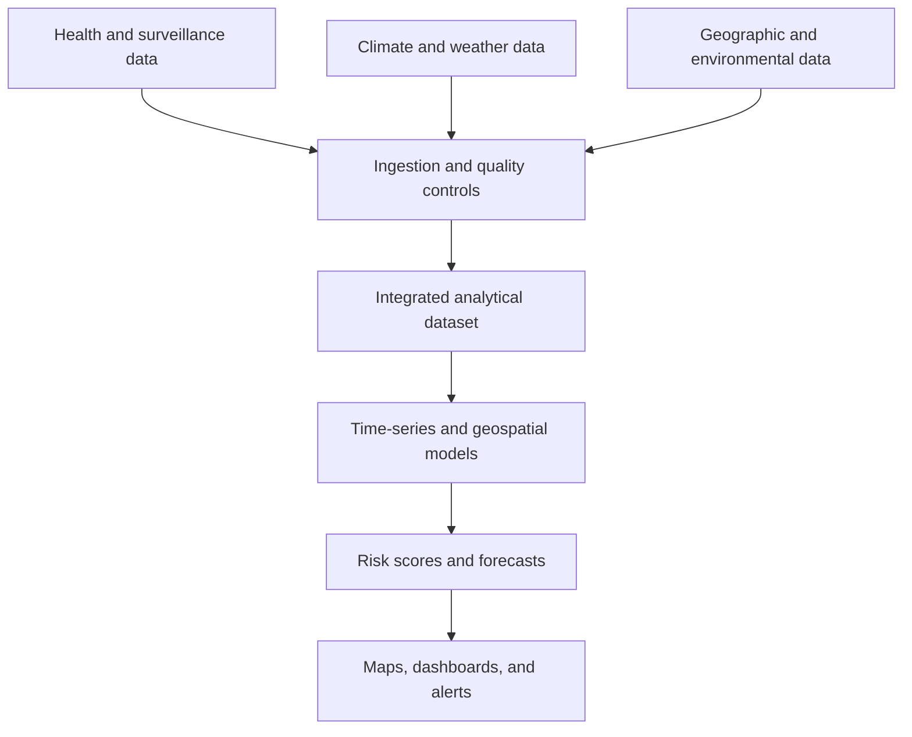

# FungiAlert

### Anticipating risk, protecting the future

[](https://react.dev/)
[](https://www.typescriptlang.org/)
[](https://vite.dev/)
[](#implementation-status)

FungiAlert is an **academic data-product design and interactive prototype** for the early identification and geospatial communication of fungal-disease risk in the United States. The project focuses on two high-impact diseases: **Candida auris** and **coccidioidomycosis (Valley fever)**.

It was developed for a *Data Thinking* course as an end-to-end product exercise: problem discovery, user and stakeholder analysis, business design, data-source planning, analytics and AI architecture, success metrics, risk management, and a functional frontend prototype.

> [!IMPORTANT]
> The application currently uses static or synthetic demonstration data. It does **not** ingest live public-health data, run a trained prediction model, send real alerts, or provide medical guidance. Those capabilities belong to the proposed product architecture described below.

## Why this problem matters

Fungal diseases are a growing public-health and operational challenge. The research phase used epidemiological, environmental, and economic evidence to frame the opportunity:

| Signal | Evidence used to frame the project |
| --- | --- |
| Emerging healthcare threat | Reported U.S. clinical *C. auris* cases increased by **95% from 2020 to 2021**. |
| Expanding regional burden | California's reported coccidioidomycosis incidence increased nearly **800% between 2000 and 2018**. |
| Economic impact | Fungal diseases generated more than **$7.2 billion** in U.S. healthcare costs in 2017. |

These figures describe the public-health context; they are not results produced by FungiAlert. See [References](#references) for the primary CDC sources.

## Product vision

FungiAlert explores how health, climate, geographic, and environmental data could be integrated into a decision-support product that helps institutions:

- identify areas with elevated fungal-disease risk;
- explore geographic and temporal patterns;
- communicate risk through dashboards and maps;
- prioritize surveillance and preventive action;
- design alerts for hospitals and public-health teams.

### Intended users and stakeholders

| Group | Primary need |
| --- | --- |
| Hospitals and infection-prevention teams | Earlier visibility into local risk and emerging healthcare-associated threats. |
| Healthcare professionals | Clear, contextual information to support surveillance and prevention. |
| Public-health authorities | Geographic evidence for resource allocation and intervention planning. |
| Researchers and epidemiologists | Integrated views of health and environmental variables. |

## What the project delivered

The project covers more than the interface contained in this repository:

- problem framing and secondary research;
- user, stakeholder, and value-proposition analysis;
- Business Model Canvas;
- Data Innovation Board: **Explore → Ideate → Evaluate**;
- proposed data ecosystem and governance considerations;
- target analytics and machine-learning architecture;
- OKRs, KPIs, risks, and validation criteria;
- interactive React prototype with maps and analytical visualizations;
- academic paper and final presentation.

## Implementation status

Transparency is essential when presenting a data and AI project. This table separates what exists today from the proposed production vision.

| Capability | Status | Notes |
| --- | --- | --- |
| Product research and problem definition | ✅ Completed | Documented in the paper and presentation. |
| Business model, stakeholders, OKRs, and KPIs | ✅ Completed | Defined as part of the Data Thinking process. |
| Interactive web prototype | ✅ Implemented | React, TypeScript, Tailwind CSS, Leaflet, and ECharts. |
| Demonstration maps and visualizations | ✅ Implemented | Powered by static/synthetic sample data. |
| Production data ingestion pipelines | 🧭 Proposed | CDC, NOAA, NASA, WHO, USGS, EPA, and NIH were evaluated as potential sources. |
| Trained and validated predictive models | 🧭 Proposed | Time-series and geospatial approaches form part of the target design. |
| Backend API and persistent database | 🧭 Proposed | Not included in the current repository. |
| Real-time surveillance and alert delivery | 🧭 Proposed | No production alerts or notifications are sent. |

## Data Thinking approach

The project applied a structured innovation process:

1. **Explore** — investigate the problem, affected populations, stakeholders, existing alternatives, and available evidence.
2. **Ideate** — define the value proposition, data-enabled opportunities, candidate sources, and analytical methods.
3. **Evaluate** — assess feasibility, expected impact, adoption barriers, data quality, privacy, and model risk.

The result was translated into a Business Model Canvas, a target operating concept, and a prototype designed to make the product idea testable with potential users.

## Proposed data ecosystem

| Data domain | Candidate sources | Potential contribution |
| --- | --- | --- |
| Epidemiology and surveillance | CDC, WHO | Cases, outbreaks, trends, and public-health guidance. |
| Weather and climate | NOAA, NASA | Temperature, precipitation, drought, wind, and climate anomalies. |
| Geography and environment | USGS, EPA | Land, soil, air, and regional environmental conditions. |
| Clinical and research evidence | NIH and institutional partners | Scientific context and, subject to governance, clinical variables. |



This diagram represents the **target architecture**, not a production pipeline currently running in the repository.

## Proposed analytics and AI layer

The paper evaluates an analytical workflow built around:

- time-series analysis for temporal patterns and trend forecasting;
- geospatial regression for associations between cases and environmental conditions;
- classification or risk-scoring models for regional prioritization;
- validation using predictive performance, false-alert frequency, update latency, and user adoption;
- ongoing monitoring for drift, bias, data gaps, and operational reliability.

The target accuracy and impact values in the academic work are **success criteria**, not measured outcomes:

| Proposed metric | Academic target |
| --- | ---: |
| Predictive accuracy | > 85% |
| False alerts | ≤ 3 per day |
| Data refresh latency | ≤ 30 minutes |
| Reduction in mortality | 5% target |
| Reduction in hospitalizations | 6% target |

A production implementation would require a clearly defined prediction horizon, baseline model, disease-specific evaluation protocol, sensitivity/specificity analysis, external validation, and prospective monitoring before any health-related use.

## Prototype capabilities

The current frontend demonstrates:

- an overview of the product value proposition;
- dedicated experiences for *Candida auris* and Valley fever;
- interactive Leaflet maps;
- exploratory charts built with ECharts;
- geographic and temporal risk visualizations;
- responsive navigation and dashboard-style layouts.

## Technology stack

| Layer | Technology |
| --- | --- |
| UI | React 19, TypeScript |
| Build tooling | Vite |
| Styling | Tailwind CSS |
| Mapping | Leaflet |
| Charts | Apache ECharts |
| Code quality | ESLint, TypeScript compiler, GitHub Actions |

## Repository structure

```text
.
├── .github/             # CI and dependency-update configuration
├── docs/                # Paper, slides, and supporting documentation
├── public/              # Static demonstration data and public assets
├── src/
│   ├── pages/           # Product and disease views
│   ├── App.tsx          # Navigation and routes
│   └── main.tsx         # Application entry point
├── README.md
└── package.json
```

The application now lives at the repository root. Generated dependencies and build artifacts are intentionally excluded from version control.

## Run locally

Prerequisites: Node.js 20+ and npm.

```bash
git clone https://github.com/StevenVegaL/FungiAlert.git
cd FungiAlert
npm install
npm run dev
```

Quality checks:

```bash
npm run lint
npm run build
```

## Documentation

The `docs/` directory is prepared for the academic deliverables and contains the expected filenames and upload instructions. See [`docs/README.md`](docs/README.md).

## Risks and responsible-use considerations

The academic evaluation identified four major risk areas:

- **Data quality:** incomplete, delayed, or inconsistent reporting can distort geographic risk estimates.
- **Model reliability:** false negatives may delay action, while false positives may create alert fatigue.
- **Adoption:** dashboards must fit existing public-health and hospital workflows.
- **Privacy and governance:** any future clinical-data integration would require strict access controls, de-identification, auditability, and compliance review, including HIPAA where applicable.

FungiAlert must not be treated as a diagnostic tool. Any production version would require multidisciplinary review by epidemiologists, clinicians, data-governance specialists, security teams, and relevant public-health authorities.

## Authors and contributions

- **Jaime Steven López Vega** — software development and prototype implementation; academic project author.
- **Diego Fernando Moreno Valencia** — academic project collaborator and co-author of the paper and presentation.

The development contribution is stated separately from academic authorship to accurately represent the work completed in this repository.

## References

- CDC, *Candida auris — United States, 2016–2023*: [MMWR Surveillance Summary](https://www.cdc.gov/mmwr/volumes/75/ss/ss7504a1.htm)
- CDC, *Regional Analysis of Coccidioidomycosis Incidence — California, 2000–2018*: [MMWR](https://www.cdc.gov/mmwr/volumes/69/wr/mm6948a4.htm)
- CDC, *Health Care Utilization and Expenditures for Fungal Diseases in the United States, 2017*: [CDC Stacks](https://stacks.cdc.gov/view/cdc/76446)
- CDC, *Surveillance for Coccidioidomycosis — United States, 2011–2017*: [MMWR Surveillance Summary](https://www.cdc.gov/mmwr/volumes/71/ss/ss7107a1.htm)
- CDC, *Candida auris tracking*: [current U.S. surveillance](https://www.cdc.gov/candida-auris/tracking-c-auris/index.html)

---

**Academic prototype — not for diagnosis, patient care, outbreak confirmation, or emergency response.**
